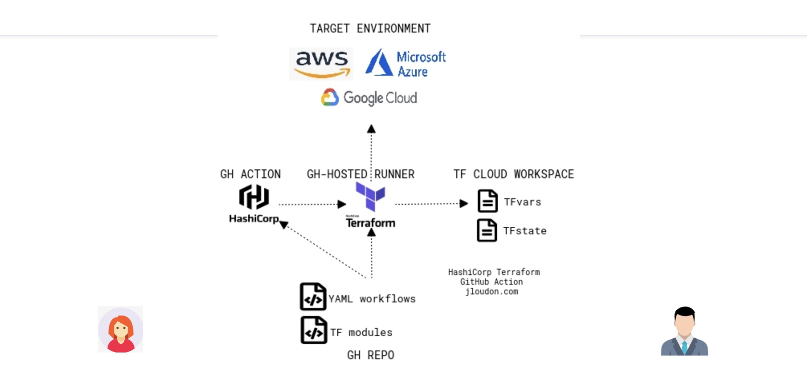

# Terrraform GitHub Actions AWS

This README serves as an in-depth guide on how to deploy an RKE2 (Rancher Kubernetes Engine) cluster on AWS using a Terraform module. This module handles the configuration and deployment of the RKE2 server and agent nodes, along with supporting the installation of Rancher, ArgoCD, and Istio.

## Table of Contents

- [Prerequisites](#prerequisites)
- [Codebase Overview](#codebase-overview)
- [Environmental Configuration](#environmental-configuration)
- [Step-by-Step Deployment Guide](#step-by-step-deployment-guide)
- [Accessing the Deployed Services](#accessing-the-deployed-services)

## Prerequisites

Before proceeding with the deployment of the RKE2 cluster, ensure you have the following prerequisites in place:

1. Terraform 

2. Terraform Cloud account

3. AWS Account & CLI: 

## Codebase Overview

## Environmental Configuration

To provision the infrastructure using this Terraform module, follow these steps:

1. **Initialize Terraform**

2. **Plan Your Infrastructure**

3. **Apply the Infrastructure Changes**

The `terraform apply` command executes the actions proposed in a Terraform plan.

